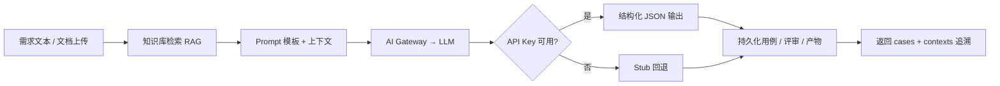
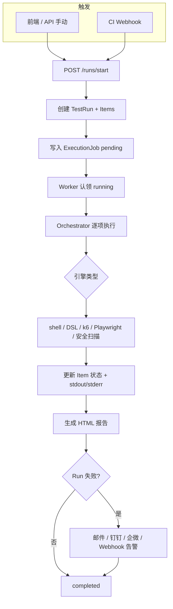

# AI 测试平台（ai-tp）项目分析报告

> 版本：v0.8.0 · 生成日期：2026-08-28  
> 本文档从**业务逻辑**与**技术栈**两个维度，对 ai-tp 项目进行高层梳理，供产品、研发与运维快速建立全局认知。

---

## 1. 项目概述

**ai-tp**（AI Testing Platform）是一个**前后端分离的 AI 驱动测试 SaaS 平台**。它将大语言模型（LLM）与专业测试引擎结合，覆盖从需求评审、用例生成到多类型自动化执行、报告与告警的完整测试生命周期。

| 维度 | 说明 |
|------|------|
| 产品形态 | B2B SaaS，支持多租户、RBAC、计费与 SSO |
| 架构风格 | 七层分层 + 五个专业 Agent 流水线 |
| 当前版本 | v0.8（接口 DSL 闭环、k6 结构化监控、安全扫描整合、任务中心） |
| 代码结构 | `backend/`（FastAPI API）、`frontend/`（Vue3 Web）、`data/`（本地数据与产物） |

---

## 2. 业务定位与核心价值

### 2.1 解决什么问题

传统测试平台往往将「用例编写」「脚本维护」「多类型执行」割裂在不同工具中；ai-tp 通过 AI Agent 降低测试资产创建成本，并通过统一 Run 编排将单元、功能、接口、性能、安全、UI 测试纳入同一工作流。

### 2.2 核心价值主张

1. **AI 辅助测试资产生产**：需求文本 → 评审报告 → 功能用例 → 接口 DSL / UI 脚本 / 压测方案 / 安全策略
2. **多引擎统一执行**：pytest、k6、Playwright、Bandit、Nuclei/ZAP 等，缺失工具时 `skipped` 而非崩溃
3. **可追溯与闭环**：RAG 知识库增强上下文、Prompt 模板版本化、失败归因与 Prompt 反馈优化
4. **企业级平台能力**：多租户隔离、AI 配额、BYOK、审计、Stripe 计费、CI Webhook 集成

### 2.3 目标用户

- QA / 测试工程师：用例管理、Run 执行、报告查看
- 研发负责人：Dashboard 趋势、CI 集成、失败告警
- 平台管理员：租户、RBAC、系统配置、k6 Worker 节点
- 组织管理员：成员、账单、AI 配额

---

## 3. 业务逻辑架构

### 3.1 领域模型（核心实体）

```text
Organization（租户）
  └── Project（项目）
        ├── FunctionalCase（功能用例）
        ├── TestPlan / TestSuite（计划与套件）
        ├── TestRun → TestRunItem（测试运行与分项）
        ├── ExecutionJob（执行任务队列）
        ├── AiArtifact（AI 产物：DSL、压测方案、安全策略等）
        ├── RequirementReview（需求评审）
        ├── KnowledgeChunk（RAG 知识片段）
        ├── Recipient（报告邮件收件人）
        ├── ProjectAiCredential（项目级 BYOK）
        ├── CiWebhookConfig（CI 集成）
        └── AiWorkbenchSession（AI 工作台会话）
```

**状态机约定**（贯穿全平台）：

| 实体 | 状态流转 |
|------|----------|
| TestRun / ExecutionJob | `pending → running → completed \| failed \| cancelled` |
| TestRunItem | `pending → running → passed \| failed \| skipped \| error` |
| AiAsyncJob | 同上，用于长耗时 AI 生成任务 |

**Run 聚合规则**：任一测试项 `failed` 或 `error`，整次 Run 判定为 `failed`。

### 3.2 五个专业 Agent 流水线

平台业务侧以 Agent 作为「生成 + 执行」门面，标准流水线顺序为：

```text
需求 Agent → UI Agent → 接口 Agent → 性能 Agent → 安全 Agent
```

| Agent | 职责 | 生成物 | 执行引擎 |
|-------|------|--------|----------|
| **需求 Agent** | 需求预评审、功能用例生成 | 评审 JSON、FunctionalCase | 评审项转用例 |
| **UI Agent** | 用例 → Playwright 脚本 | `ui_script` JSON/DSL | Playwright GUI Agent |
| **接口 Agent** | OpenAPI/需求 → API DSL | YAML DSL 产物 | httpx DSL Runner |
| **性能 Agent** | 压测方案设计 | k6 脚本方案 | k6 本地 / 分布式 |
| **安全 Agent** | Payload / 扫描策略 | 扫描配置 | builtin / nuclei / zap / bandit |

Agent 目录 API：`GET /ai/agents`（含网关统计与质量指标）。

### 3.3 五大 AI 业务模块

与 Agent 对应，Prompt 模板按 `module_type` 管理：

| 模块 | module_type | 典型 API |
|------|-------------|----------|
| 需求预评审 | `requirement_review` | `POST /projects/{id}/ai/requirement-review` |
| 功能用例 | `functional_cases` | `POST /projects/{id}/ai/functional-cases` |
| 接口自动化 | `api_automation` | `POST /projects/{id}/ai/api-automation` |
| 性能方案 | `perf_plan` | `POST /projects/{id}/ai/perf-plan` |
| 安全策略 | `security_scan` | `POST /projects/{id}/ai/security-scan` |

### 3.4 测试执行类型（Run Kind）

| Kind | 默认行为 | 智能路由 |
|------|----------|----------|
| `unit` | `pytest -q` | — |
| `functional` | 套件/计划驱动用例执行 | 有用例 `ui_script` 时走 Playwright |
| `api` | `pytest -q tests/api` | 有 DSL 产物时走 `dsl://api-automation` |
| `perf_backend` / `perf_frontend` | k6 脚本 | AI 压测方案 + 分布式 k6 |
| `sec_backend` | `bandit -r .` | 整合 AI 安全扫描 |
| `sec_frontend` | `npm audit` | — |
| `ui` | `playwright test` | UI Agent 脚本 |

**弹性执行语义**：工具未安装、路径不存在、零用例收集等场景标记为 `skipped` 并记录 `detail.reason`，不影响其他测试项与 Run 整体流程。

---

## 4. 核心业务流程

### 4.1 AI 用例生成（RAG + Agent）



**关键步骤**：

1. 入库知识：`POST /projects/{id}/knowledge/chunks`（PRD、业务规则、历史缺陷）
2. Agent 生成：`POST /projects/{id}/functional-cases/generate-agent`
3. 向量检索命中片段拼入 Prompt，返回所用知识便于审计

### 4.2 测试 Run 全生命周期



**队列后端**（`JOB_QUEUE_BACKEND`）：`db`（默认）/ `redis` / `rq` / `celery`，生产建议 API 与 Worker 分离。

### 4.3 需求预评审增强（v0.6+）

1. 上传 `.docx` / `.md` / `.txt` 解析需求
2. AI 输出结构化评审（歧义、逻辑缺失、可测性、业务风险）
3. HTML 在线预览、两版 diff 对比
4. 评审项一键转功能用例（模块 1→2 打通）

### 4.4 CI/CD 集成

- 配置：`GET/PUT /projects/{id}/integrations/ci`
- 触发：`POST /integrations/ci/{id}/webhook`（`X-CI-Token` 鉴权）
- Run 完成后可选 GitHub PR 评论
- 与租户隔离例外：Webhook 路由不经过常规项目租户校验

### 4.5 商业化与租户流程

```text
用户登录（本地 / OIDC SSO）
  → 归属 Organization
  → 项目创建（受 max_projects 限制）
  → AI 调用计入 ai_call_logs
  → 超额拦截（monthly_ai_token_quota）
  → Stripe Checkout 支付（可选）
  → 账单 PDF 导出
```

---

## 5. 技术栈总览

### 5.1 后端

| 类别 | 技术 | 用途 |
|------|------|------|
| 语言 | Python ≥ 3.11 | 主运行时 |
| Web 框架 | FastAPI + Uvicorn | REST API、OpenAPI/Swagger |
| ORM | SQLAlchemy 2.x | 数据访问 |
| 校验 | Pydantic v2 + pydantic-settings | DTO / 配置 |
| 迁移 | Alembic | 数据库版本管理 |
| HTTP 客户端 | httpx | DSL 执行、外部调用 |
| 模板 | Jinja2 | 报告 HTML 渲染 |
| 文档解析 | python-docx, pypdf | 需求文档上传 |
| 加密 | cryptography (Fernet) | BYOK 密钥、登录加密 |
| PDF | fpdf2 | 评审报告、账单 PDF |
| 序列化 | PyYAML | API DSL |
| 浏览器自动化 | Playwright | UI Agent 执行 |
| 测试 | pytest, ruff | 单元/集成测试、Lint |

**可选依赖组**（`pyproject.toml`）：

| Extra | 包 | 场景 |
|-------|-----|------|
| `mysql` | pymysql | 生产 MySQL |
| `redis` | redis | 队列、缓存、OIDC state |
| `worker` | rq, celery | 分布式任务 Worker |
| `billing` | stripe | 在线支付 |
| `observability` | prometheus-client, OpenTelemetry | 监控与链路 |
| `dev` | pytest, ruff, prometheus-client | 开发 |

### 5.2 前端

| 类别 | 技术 | 用途 |
|------|------|------|
| 框架 | Vue 3.5 + TypeScript | SPA |
| 构建 | Vite 5 | 开发与打包 |
| UI 组件 | Arco Design Vue | 企业级界面 |
| 路由 | Vue Router 5 | 页面与权限路由 |
| 图表 | ECharts + vue-echarts | Dashboard、k6 时序 |
| 加密 | node-forge | 登录密码前端加密 |

**前端架构特点**：

- `ShellLayout` 统一壳层 + RBAC 路由守卫（`router/permissions.ts`）
- `ProjectLayout` + `provideProjectScope` 项目上下文注入，子页复用项目数据
- 智能流水线 UI：`AiPipelineBar` 展示 01–05 Agent 步骤

### 5.3 数据存储

| 存储 | 用途 |
|------|------|
| SQLite / MySQL 8 | 主业务库（开发 SQLite，生产 MySQL） |
| Redis 7 | 任务队列通知、AI 上下文缓存、OIDC state（多副本必需） |
| 本地文件 `data/` | UI Agent 截图/视频、运行时产物 |

### 5.4 外部测试与安全工具（Worker 镜像）

| 工具 | 测试类型 |
|------|----------|
| pytest | 单元 / API |
| k6 | 性能压测（支持分布式 Worker 节点） |
| Playwright | UI 自动化 |
| bandit | Python 安全静态分析 |
| npm audit | 前端依赖漏洞 |
| nuclei / OWASP ZAP | 动态安全扫描 |

### 5.5 AI / LLM 集成

| 组件 | 说明 |
|------|------|
| AI Gateway | `backend/services/ai/gateway.py` 统一 LLM 入口 |
| LLM Client | OpenAI 兼容 API，支持多模型路由 |
| 模型策略 | 高精度任务 → `AI_HIGH_PRECISION_MODEL`；批量任务 → `AI_BULK_MODEL` / 本地模型 |
| 回退 | 无 API Key 时 Stub 结构化 JSON，便于本地联调 |
| Prompt 管理 | 内置 5 套模板 + 版本化 + 反馈闭环优化 |
| RAG | 向量 embedding 存储于 `knowledge_chunks.embedding` |
| 用量统计 | `ai_call_logs` + Token 配额拦截 |

### 5.6 可观测性与告警

| 能力 | 实现 |
|------|------|
| Prometheus | `GET /metrics`，HTTP/Job 计数与耗时 |
| 链路追踪 | `X-Request-ID` / `X-Trace-ID`；可选 OTLP 导出 |
| Dashboard | `/dashboard/summary`、`/dashboard/run-trends`（租户隔离） |
| 失败告警 | SMTP 邮件、钉钉、企微、通用 Webhook |

---

## 6. 系统分层架构（七层）

```text
┌─────────────────────────────────────────────────────────────┐
│  接入层    FastAPI REST · Vue3 SPA · CI Webhook            │
├─────────────────────────────────────────────────────────────┤
│  业务服务层  Services + 5 Agents + Workflow + Report        │
├─────────────────────────────────────────────────────────────┤
│  AI 网关层   gateway.complete → llm_client（统计/路由）       │
├─────────────────────────────────────────────────────────────┤
│  调度层      job_queue · ai_job_queue · k6_scheduler        │
├─────────────────────────────────────────────────────────────┤
│  执行引擎层  Playwright · API DSL · k6 · Security Scanner   │
├─────────────────────────────────────────────────────────────┤
│  存储层      MySQL/SQLite · Redis · 文件对象存储             │
├─────────────────────────────────────────────────────────────┤
│  监控指标层  Prometheus · Agent quality · Audit Logs        │
└─────────────────────────────────────────────────────────────┘
```

**后端代码分层约定**：

```text
backend/api/routes/   → HTTP 入口（校验、编排，不直接调引擎）
backend/services/     → 业务逻辑
backend/models/       → SQLAlchemy 实体
backend/schemas/      → Pydantic DTO
backend/services/engines/  → 测试引擎适配
backend/services/agents/   → 专业 Agent
```

---

## 7. 权限与安全模型

### 7.1 RBAC

- 用户 ↔ 角色 ↔ 权限（多对多）
- 组织成员角色：`org_admin` / `member` / `viewer`
- 典型权限码：`project.read`、`case.write`、`run.execute`、`ai.read`、`ai.execute`、`prompt.write`、`billing.*`、`org.member.*`

### 7.2 租户隔离

- 普通用户仅能访问本 `organization_id` 下资源
- `organization_id = null` 为平台管理员，可跨租户
- 项目/Run 路由经 `get_tenant_project` / `get_tenant_run` 校验

### 7.3 认证方式

- 本地用户名密码（前端 RSA 加密传输）
- OIDC SSO（可选，`OIDC_ENABLED`）
- CI Webhook Token（`X-CI-Token`）
- Metrics Bearer Token（可选）

---

## 8. 部署架构

### 8.1 本地开发

```text
Backend:  uvicorn backend.main:app --port 8001
Frontend: npm run dev → :5174
Worker:   python -m backend.worker（可选）
```

### 8.2 Docker Compose（推荐生产形态）

```text
┌──────────┐  ┌──────────┐  ┌──────────┐
│  nginx   │  │   api    │  │  worker  │
│  (web)   │──│ FastAPI  │  │ k6/PW/   │
│  :8088   │  │  :8002   │  │ nuclei   │
└──────────┘  └────┬─────┘  └────┬─────┘
                   │             │
              ┌────┴─────┐  ┌────┴────┐
              │  MySQL   │  │  Redis  │
              │   8.4    │  │    7    │
              └──────────┘  └─────────┘
```

- API 与 Worker 分离；Worker 使用 `worker-tools` 镜像（含 k6、Playwright、nuclei）
- 启动时 `alembic upgrade head` + `SCHEMA_BOOTSTRAP_MODE=alembic`
- 默认队列：`JOB_QUEUE_BACKEND=rq`

---

## 9. 版本能力演进摘要

| 版本 | 重点能力 |
|------|----------|
| v0.4 | DSL 执行器、k6 下发、Prompt 闭环、Alembic、Arco 前端 |
| v0.5 | 安全扫描引擎、分布式 k6、全量 Arco RBAC |
| v0.6 | 需求文档上传、HTML 预览、评审 diff、转用例 |
| v0.7 | 接口 DSL 闭环、回归集、失败归因 AI |
| v0.8 | k6 结构化监控、向量 RAG、任务中心、安全报告整合 |
| P2 | 多租户、配额、BYOK、Stripe、OIDC、AI 工作台、CI Webhook |

---

## 10. 关键设计原则

1. **API-only 后端**：根路径返回健康 JSON，不做服务端模板渲染（报告内容为 API 生成 HTML 字符串）
2. **弹性执行**：工具缺失 → `skipped`，不 hard-crash
3. **显式状态机**：Run / Job / Item 状态持久化、可查询、可取消/重试
4. **报告完整性**：摘要表 + 每项 stdout/stderr 明细
5. **最小侵入扩展**：优先扩展现有 `services/` 模块，避免平行抽象
6. **AI 可观测**：Token 日志、Prompt 版本、RAG 上下文追溯、Stub 本地联调

---

## 11. 相关文档索引

| 文档 | 内容 |
|------|------|
| [README.md](../README.md) | 快速启动与配置 |
| [ARCHITECTURE.md](./ARCHITECTURE.md) | 七层架构、队列、P2 细节 |
| [DEPLOYMENT.md](./DEPLOYMENT.md) | 生产部署 |
| [DEPLOYMENT.DOCKER.md](./DEPLOYMENT.DOCKER.md) | Docker Compose 部署 |
| [DOCKER_HUB.md](./DOCKER_HUB.md) | 镜像推送与异地运行 |

---

## 12. 总结

ai-tp 是一个**以 AI Agent 为测试资产生产引擎、以统一 Run 编排为执行枢纽**的企业级测试平台。业务上打通「需求 → 用例 → 多类型自动化 → 报告 → 告警 → Prompt 优化」闭环；技术上采用 FastAPI + Vue3 主流栈，通过七层架构、可插拔任务队列与弹性执行语义，兼顾本地开发与 SaaS 规模化部署需求。
